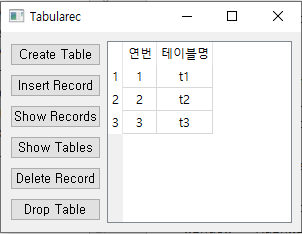

# TabulaREC
 A tabular recording program. Using SQLite, user can record or delete data as tables.

<center>



</center>

# Functions

### Create Table

 - User can create table

### Insert Record

 - User can insert record at certain table

### Show Records

 - User can see datas in the table.

### Show Tables

 - Users can see all table list.

### Delete Record

 - User can delete certain record at a table.

### Drop Table
 - User can delete certain table

# Requirements
```
pyqt >= 5.9.2
```
